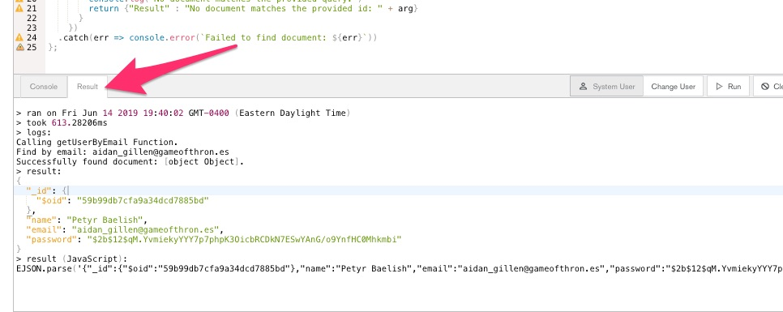
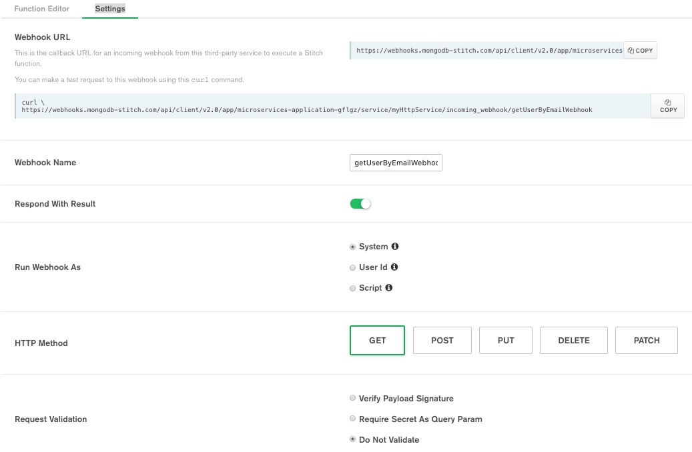

# [MongoDB World](https://www.mongodb.com/world) 2019 Builder's Fest
## Wednesday, June 19, 2019

### Microservices with MongoDB Stitch
As the microservices architectural pattern continues to grow in popularity, 
this session will demonstrate how quickly and easily a developer can expose 
data in MongoDB Atlas via REST APIs.  Attendees will be guided step-by-step 
on how to access and modify their data in a matter of minutes using a simple
webhook.

# Required Prerequisites
### MongoDB Atlas Account
In order to successfully complete this quick tutorial, the user should have the
following tasks completed:
* Complete [Getting Started with MongoDB Atlas](https://docs.atlas.mongodb.com/getting-started/).  This involves
creating an Atlas account, creating your first free tier cluster, and setting up
the appropriate security credentials.

* Load Sample data into your cluster by following the [Insert Data into Your Cluster](https://docs.atlas.mongodb.com/getting-started/#insert-data-into-your-cluster)
section of the Getting Started Guide.

* Ensure the *sample_mflix* database has been created and contains the *users* collection.  This 
data can be easily verified within the MongoDB Atlas UI by using the [Data Explorer](https://docs.atlas.mongodb.com/data-explorer/index.html)
or connecting to your MongoDB Atlas cluster by using [MongoDB Compass](https://www.mongodb.com/products/compass).

### GitHub repo for Python source and README
After creating your Atlas cluster and loading the sample data, you are now ready to begin
interacting with it.  To complete the remainder of this tutorial, you will need to install the
following:

*  If you are familiar with *git* and have it installed, you can simply:
```
git clone https://github.com/blainemincey/stitch-microservices-mdbw2019.git
```

### Important Note: 
You have the option of interfacing with the REST API via [Python3](https://www.python.org/downloads/),
[Postman](https://www.getpostman.com/), or the command-line utility [curl](https://curl.haxx.se/download.html).  This guide will highlight what is required to interface via each
method.

# Use Case Description
The development team at XYZ is excited that they are beginning the move to the cloud
with their first MongoDB deployment on MongoDB Atlas.  After months of frustration, they will no longer
have to worry about having to wait for weeks for infrastructure to be provisioned
or the inability to scale on-demand as their application begins to gain traction.  Their movie 
search service has taken off and they are constantly adding new users each day.
Just as the development team is beginning to focus on their next iteration of 
their project, they receive a last minute (Friday at 5pm) request that there is a 3rd party
system that needs to interface with the user data in MongoDB Atlas.  The problem is
that the *only* way for the 3rd party to interface with the data is via REST.  Now the
team is going to have to build a REST API and find somewhere to provision a server
as well as work on network/firewall rules, etc.....blah blah.  However, one of the 
developers on the team was researching additional capabilities on MongoDB Atlas and
came upon this thing called MongoDB Stitch.  Following is what the developer 
accomplished in less than 30 minutes so the team could make the 6pm kickoff for
the Atlanta United match!

# MongoDB Stitch Tutorial

### Step 1 - Create Stitch Application
After completing the steps above, you can now create your Stitch Application.  First,
click the Stitch menu option in the left-hand navigation in the Atlas UI.  After clicking
this, the *Create New Application* button will appear in the center of the screen.  
Note: If you have already created a Stitch Application within this project, the
*Create New Application* button will be in the top-right of the Atlas UI similar
to the image below.

  

After clicking the button, you will be presented with the following dialog:

  

Enter a name for your application.  In this example, we name it *Microservices-Application*.
Be sure to keep the remainder of the defaults and be sure to be linked to your Cluster!
Now, click the *Create* button.  You will then be taken to the *Welcome to Stitch!* 
home page.

### Step 2 - Create Stitch Function
If you have inspected the *movies* collection, you may have noticed that there is a
unique index on the email field.  It makes sense that we need to be able to retrieve
a unique user by their unique email.  Let's create a function to find a user by their
email.

We will need to select the *Functions* option in the left-hand navigation and in the
Function page click the green button, *Create New Function*.  It should look similar
to that below:

  

The function editor will open.  You should name your function, *getUserByEmailFunction*.
Keep the rest of the defaults and click Save.  It should look like that below:

  

After you click save, the sample function template will be available.  Copy and paste
the Javascript code below into the Function Editor window.  Notice, we are executing
our find query againt the *sample_mflix* database and the *users* collection.
```
//
// To test in console: exports('aidan_gillen@gameofthron.es')
//
exports = async function(arg) {
  
  console.log("Calling getUserByEmail Function.");
  console.log("Find by email: " + arg);

  var usersCollection = context.services.get("mongodb-atlas").db("sample_mflix").collection("users");
  
  const query = { "email": arg };

  return usersCollection.findOne(query)
    .then(result => {
      if(result) {
        console.log(`Successfully found document: ${result}.`)
        return result;
      } 
      else {
        console.log("No document matches the provided query.")
        return {"Result" : "No document matches the provided id: " + arg}
      }
    })
  .catch(err => console.error(`Failed to find document: ${err}`))
};
```

Once the code has been pasted, click the save button in the upper right-hand corner
of the Stitch UI.  Once that has been saved, we can run a quick smoke test of our function.
In the comment section at the top of the code block, you will find a snippet indicating
you can use it to test with.  Specifically, you should copy this below:
```
exports('aidan_gillen@gameofthron.es')
```

Once you copy this, you will then click the Console tab at the bottom of the
screen.  Remove the 'Hello World' snippet in the console that is there by default.
Paste the snippet above into it.  It should look similar to that below:


Once you have pasted the code snippet, click the Run button in the lower right-hand
corner to the console.  You should then see the Result tab become enabled with
the result.  It should resemble that below:

  


# Step 3 - Create HTTP Service
Now that we have successfully tested our function, let's create an HTTP Service
so we can interface with it via REST.  First, click the *Services* link in the left-hand
navigation.  This will open the *Add a Service* screen.  Click the *Add a Service*
button in the center or the upper right-hand corner of the screen.  It should look
like this below:

  

The *Add a Service* entry screen will appear.  Select *HTTP* and then name the 
service *myHttpService*.  Click the *Add Service* button on the lower right-hand
side of this dialog.  It should be similar to that below:

  

Now, we will want to click the *Add Incoming Webhook* button.  It should be similar
to that below:

  

We will name the Webhook *getUserByEmailWebhook*.  Be sure to toggle the *Respond with Result*
switch.  Select *GET* as your HTTP Method.  Then, be sure to select the *Do Not Validate*
radio button.  Once your dialog resembles the image below, click Save.

  

We will be brought into the Function Editor for our webhook.  Recall in an earlier
step that we created a function to get our user by email address.  We are simply
going to call that function.  Copy the code below and paste it into the function
editor over the default code that is placed there.

```
// This function is the webhook's request handler.
//
// To test: exports({query: {email: 'sean_bean@gameofthron.es'}})
exports = async function(payload, response) {
  
  console.log("Executing Webhook getUserByEmail.");
  
  // Query params, e.g. '?arg1=hello&arg2=world' => {arg1: "hello", arg2: "world"}
  const {email} = payload.query;
  
  console.log("Query arg: " + email);
  
  // Calling a function:
  return await context.functions.execute("getUserByEmailFunction", email);
};
```
If you would like to quickly test this function, you can use the code snippet
that is in the top comment block.  Specifically, it is this:
```
exports({query: {email: 'sean_bean@gameofthron.es'}})
```
Run the test exactly as we did in an earlier step.  Now, let's finally interface
with our REST API!!

### Step 4 - Test the API via REST
Since this is a REST based API, we can basically use just about any tool that we
are comfortable with.  For this example, we will show how to use the included Python3
script that is part of this repository, using Postman, or simply the command line
utility cURL.

Since we should still be in the Function Editor for our webhook, we need to click
the *Settings* tab at the top of the page. In this screen, we can copy our
Webhook URL.  There is even an example cURL example that can simply be copied and pasted.
Please note, these are simply the URL without the query argument!  We will need
to manually do that.  We can't take all the fun out of coding this up!

The Settings screen should look like that below:

  

**Test with Python3**  
If you have Python3 installed, you can test with the included Python3 script.  Prior
to running, be sure you have the requests module installed.  This can be done
with the following command:
```
pip3 install requests
```

Copy the Webhook URL.  Open the get_user_by_email.py script.  Towards the bottom
of the script are the constants.  You will need to be sure and paste your unique
Webhook URL in the URL variable.  An existing EMAIL is provided.  The bottom
of the script should be something along the lines of the following:
```
####
# Constants
####
URL = "https://webhooks.mongodb-stitch.com/api/client/v2.0/app/microservices-application-pkgif/service/myHttpService/incoming_webhook/getUserByEmailWebhook"
EMAIL = "sean_bean@gameofthron.es"
```
Once you have installed the requests module and made your edits to the script, you
can run the script from the command line with:
```
python3 get_user_by_email.py
```
Upon a successful execution of the script, you should see something like the 
following:
```
$ python3 get_user_by_email.py 
============================
     GET User by Email      
============================
Starting Fri Jun 14 20:05:43 2019

{
    "_id": {
        "$oid": "59b99db4cfa9a34dcd7885b6"
    },
    "email": "sean_bean@gameofthron.es",
    "name": "Ned Stark",
    "password": "$2b$12$UREFwsRUoyF0CRqGNK0LzO0HM/jLhgUCNNIJ9RJAqMUQ74crlJ1Vu"
}

Ending Fri Jun 14 20:05:43 2019
====================================================
Total Time Elapsed (in seconds): 0.24088865799999998
====================================================

```

**Test with Postman**  
If you have installed Postman, you can simply create a new GET request and paste
the URL.  You will need to be sure and add the query parameter.  Your request in
Postman should be similar to that below:

  

**Test with cURL**  
Testing with curl could not be easier if you have it installed.  Simply copy
the curl command that is given from the Webhook Settings window.  You will
need to be sure and add the proper query parameter to the end.  Your curl
command should be somewhat similar to this below:
```
https://webhooks.mongodb-stitch.com/api/client/v2.0/app/microservices-application-gflgz/service/myHttpService/incoming_webhook/getUserByEmailWebhook?email=sean_bean@gameofthron.es
```
Specifically, you should simply paste your curl command into your terminal and
add the following snippet to the end of the curl command:
```
email=sean_bean@gameofthron.es
```
When you run the curl command, you should see output similar to that below:
```
$ curl https://webhooks.mongodb-stitch.com/api/client/v2.0/app/microservices-application-gflgz/service/myHttpService/incoming_webhook/getUserByEmailWebhook?email=sean_bean@gameofthron.es
{"_id":{"$oid":"59b99db4cfa9a34dcd7885b6"},"name":"Ned Stark","email":"sean_bean@gameofthron.es","password":"$2b$12$UREFwsRUoyF0CRqGNK0LzO0HM/jLhgUCNNIJ9RJAqMUQ74crlJ1Vu"}
```

### Step 5 - Create POST Webhook
Not only will we require the ability to find existing users, we will also want
to add or POST new users to our users collection.  In order to do this, we will
need to add an additional Webhook.  Click the Services link in the left-hand
navigation.  You should see your existing *myHttpService*.  Click on this.  You
will have a listing of your existing Webhook.  You should see the *getUserByEmailWebhook*
we created in an earlier step.  It should look like the image below:

  

Click the *Add Incoming Webhook* button in the upper right-hand corner of the
UI.  We will name the Webhook *postNewUserWebhook*.  Be sure to toggle the *Respond With Result*
switch.  The HTTP Method will be POST.  Finally, *Do Not Validate* should be selected.
Your screen should look like that below.  When it does, click save.

  

The now familiar Function Editor should open.  We want to copy and paste the code
block below over the existing code sample.
```
//
exports = async function(payload) {
  console.log("Executing New User Webhook.");
  
  //Accessing a mongodb service:
  var collection = context.services.get("mongodb-atlas").db("sample_mflix").collection("users");
    
  var payloadBody = EJSON.parse(payload.body.text());
  
  if(payloadBody) {
    
      // create the new user document
      // email is a unique index so it must be unique
      var userDocument = {
        name       : payloadBody.name,
        email      : payloadBody.email,
        password   : payloadBody.password,
        birthdate  : new Date(payloadBody.birthdate),
        updatedate : new Date()
      };
      
      // insert the new user - use await to make sure it is inserted prior to finding it!
      await collection.insertOne(userDocument).then(result => {
        const {insertedId} = result;
        console.log(`Inserted new user with _id: ${insertedId}`);
      });
      
      // Let's return the complete new user document
      return await context.functions.execute("getUserByEmailFunction", payloadBody.email);
  }
  else {
    return {"Result" : "Invalid payload body."};
  }
      
};

```

At a high level, the Javascript code takes the payload body and parses out the
JSON.  Remember, the email address we use must be unique or the database will throw
an error.  We add an updatedate field as well.  Then, we insert this JSON and
then return the inserted document using the function we created earlier.

Once this code as been pasted, be sure to Save the function.  Once saved, click
on the settings tab and we will walk through how to POST data to our database.
As an example, your settings for the POST Webhook should look like this below:

  

### Step 6 - Test our POST Webhook  
We have already tested our API via our GET methods in Step 4 of this tutorial.
Follow the same method as in Step 4.  You will need to open the *Settings* tab
of your *postNewUserWebhook*.  Copy the Webhook URL and you are ready to begin
testing.  Following are high-level instructions on testing with Python3, Postman,
and cURL.

**Test with Python3**  
Open the Python3 file *post_user_birthday.py*.  Towards the bottom of the script
you will find the Constants for the script.  Find URL and past your Webhook
URL that you just copied.  After you paste you URL in the variable URL, it should
look similar to that below:
```
####
# Constants
####
URL = "https://webhooks.mongodb-stitch.com/api/client/v2.0/app/microservices-application-pkgif/service/myHttpService/incoming_webhook/postNewUserWebhook"
```

If you inspect the Python3 script in the *main* method, you will find the following
User document that will be inserted into your users collection:
```
# sample_mflix.movies has unique index on email
    # if use today's Month and Day as birthday, trigger will fire
    user_document = {
        "name": "Blaine Mincey",
        "email": "blaine@here.there",
        "password": "securepassword",
        "birthdate": "2000-06-14"
    }
```
Feel free to modify the name to something else.  Be sure that the email address
is unique to the users collection (unique index).  Also, if you set the birthdate
to today's day, there is an extra credit exercise at the end of this lab!

Once your modifications have been made, save the script and run it.  You should run it
with the following command and if successful, the output should be similar as well.
```
$ python3 post_user_birthday.py 

============================
     POST New User          
============================
Starting Sat Jun 15 16:44:35 2019

{"_id":{"$oid":"5d0558b3a11ac19ca39921d4"},"name":"Blaine Mincey","email":"mycoolemail@here.com","password":"securepassword","birthdate":{"$date":{"$numberLong":"45705600000"}},"updatedate":{"$date":{"$numberLong":"1560631475471"}}}

Ending Sat Jun 15 16:44:35 2019
====================================================
Total Time Elapsed (in seconds): 0.28215846099999997
====================================================

```

If you inspect the output, you will see that the JSON document returned as added
an _id field as well as an updatedate.

**Test with Postman**  
Testing with Postman is incredibly easy as well.  Be sure you have copied the
Webhook URL for our POST webhook and paste into Postman.  Be sure to select
POST as the operation.  Then, select the Body tab and select application/json as
the Body type.  For the body, you could use something similar to this:
```
{
	"name" : "Blaine Mincey",
	"email" : "anotheremail@there.com",
	"password" : "securepassword",
	"birthdate" : "2001-06-13"
}
```

Once everything is setup similar to the image below, click the *Send* button.  You
should receive output similar to what is in the output in the image below.

  


**Test with cURL**  
Testing with cURL is incredibly simple if you have already have the utility installed.
Simply copy the cURL example in the Settings tab of the *postNewUserWebhook*.  You
will need to be sure to modify the JSON document that is sent to match what we
have used in the previous two examples.  Your curl command should look similar to this
below.  Notice that the -d argument is expecting the JSON document to insert.  The
successful output is indicated below as well.

```
$ curl -H "Content-Type: application/json" -d '{ "name":"My New User", "email":"myNewUserEmail", "password":"mySecurePassword", "birthdate":"2001-06-13"}' https://webhooks.mongodb-stitch.com/api/client/v2.0/app/microservices-application-pkgif/service/myHttpService/incoming_webhook/postNewUserWebhook
{"_id":{"$oid":"5d055c4792418d4da2dd4cbd"},"name":"My New User","email":"myNewUserEmail","password":"mySecurePassword","birthdate":{"$date":{"$numberLong":"992390400000"}},"updatedate":{"$date":{"$numberLong":"1560632391262"}}}
```

## Congratulations!
## You have completed this tutorial!  

**If you feel like continuing on, there is a Step 7 if you so desire.  Should take
you no more than another 5 minutes to complete.**  


### Step 7 - Extra Credit - Database Trigger
As part of getting closer to the users of our application, we would like to 
recognize them on their birthday.  As the marketing department irons out the details
of what type of recognition the user would receive, the development team has
decided to go ahead and complete part of the code to make this happen.  Basically,
when a new user is inserted into our users collection, if their birthday happens
to be on the day that they create a profile, we want to have immediate notification
of that.

All it takes is creating a Stitch Database Trigger.

First click the Triggers link in the left-hand navigation and then click the 
button *Add a Trigger*.  You will want the Trigger Type to be Database Triggers.
Name the trigger *myBirthdayTrigger*.  Be sure to enable it.  Be sure that the databse
selected is *sample_mflix* and the collection is *users*.  Then, for operation
type, click the *Insert* checkbox.  Select to receive the Full Document.  Finally,
for the function, we will create something new, so select *+ New Function* in the Function
dropdown.  You can name it *itsYourBirthdayTriggerFunction*.
Your page should look similar to this below:

  

If you trigger definition looks similar to that above, click Save.  Now, you will
have the familiar Function Editor.  Paste the code below into your new function
definition and click Save.

```
//
// Trigger Function fired on insert.  If today is the birthday, celebrate!!
//
exports = function(changeEvent) {
  console.log("Executing itsYourBirthdayTriggerFunction.");
  
  if(changeEvent.operationType === 'insert') {
    console.log("Insert operation.");
    
    const { birthdate } = changeEvent.fullDocument;
    
    // Grab the month and day today
    var today = new Date();
    var monthToday = today.getMonth();
    var dayToday = today.getDate();
    
    // Grab the birth month and birth day
    var birthMonth = birthdate.getMonth();
    var birthDay   = birthdate.getDate();
    
    // If all things are equal, Birthday!!
    if(monthToday === birthMonth && dayToday === birthDay){
      
      var message = "Time to celebrate!  It's your Birthday!!!";
      
      console.log(message);
      
      const{name,email} = changeEvent.fullDocument;
      
      birthdayNotificationDocument = {
        name           : name,
        email          : email,
        message        : message,
        notificationTs : new Date()
      };
       
      var collection = context.services.get("mongodb-atlas").db("sample_mflix").collection("birthdayNotifications");
      
      collection.insertOne(birthdayNotificationDocument).then(result => {
        const {insertedId} = result;
        console.log(`Inserted new notification with _id: ${insertedId}`);
      })
    }
  }
};

```

In a nutshell, this  function simply looks at the birthday if a newly inserted
user into the users collection.  If that user's birthday is today (checking the
month and day), it will create
a new collection (birthdayNotifications) and insert values there so the user can 
be notified later.

After saving this function, now POST a new user to your users collection with
a date of today.  Everything should look the same, except you should now have
a new collection in your database with a new document.  You can also check
the Logs of your Stitch application to verify things fired properly and
to check the function output.

### Now you are finally complete!
